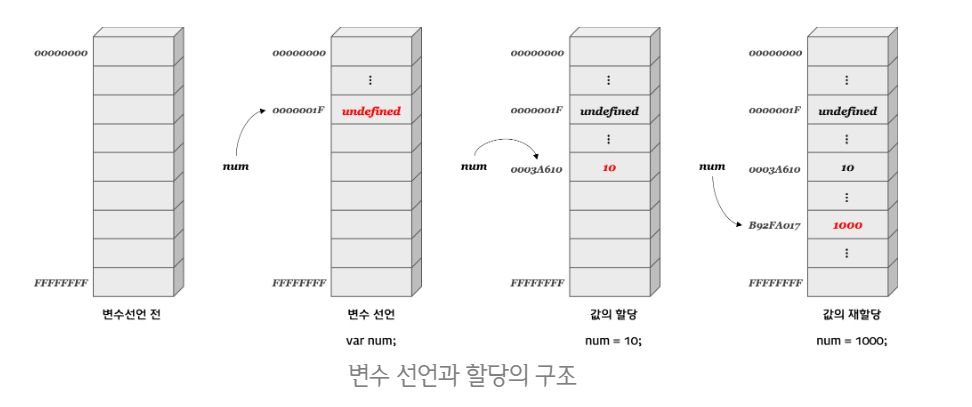

# Variable\(변수와 상수\)


### 01. 변수\(Variable\)란?

* 데이터를 저장할 때 쓰이는 “이름이 붙은 저장소”
* 값의 위치\(주소\)를 기억하는 저장소 
  * 값의 위치란 값이 위치하고 있는 메모리 상의 주소를 의미
* 즉, 변수란 값이 위치하고 있는 메모리 주소에 접근하기 위한 **식별자**



### 02. 변수 선언 및 할당

자바스크립트에서 변수와 상수를 선언하는 키워드는 3가지이다. 

* **var \(ES5\)**
  * 변수 선언과 동시에 값 초기화
  * 함수 단위 범위의 변수 선
* **let \(ES6\)**
  * 블록 범위\(scope\) 지역 변수 선언
  * 동시에 값 초기화 
* **const \(ES6\)**
  * 블록 범위 _**읽기 전용 상수**_를 선언 

자바스크립트에서 var, let 키워드를 이용해 선언과 동시에 값을 할당 할 수 있다. 또한 ,\(쉼표\)를 사용하여 여러 개의 변수를 한 문장에 선언 할 수 있다.    
 지정된 초기값 없이 선언된 변수는 [`undefined`](https://developer.mozilla.org/ko/docs/Web/JavaScript/Reference/Global_Objects/undefined) 값을 갖습니다.

### 📌 상수

* 변화하지 않는 변수를 상수라 하며 선언시 const를 사용한다.
* 변수의 값이 절대 변하지 않는 경우 선언한다.
* 재할당할 수 없으므로 상수를 변경하려고 하면 에러가 발생한다.

```javascript
// 변수 선언
// var 변수명 = 할당할 값; ES5
// let 변수명 = 할당할 값; ES6

var str = 'Hello'
let nun = 2020
let empty; // 변수 empty 선언, undifined

let a, b, c;
let a = 1,
    b = 2,
    c = 3; // ,를 이용해 여러개의 변수 선언 및 초기

// 상수 선언
const bool = true;
bool = false; // error, can't reassign the constant!
```

### 03. 변수 명명 규칙  

*  알파벳\(`A~Z, a~z`\), 숫자\(`0~9`\), 언더바\(`_`\), 달러 기호\(`$`\) 사용 가능
* 첫 글자로 숫자를 사용할 수는 없다.
* 예약어를 사용할 수 없다.
  * [예약어 목록](https://developer.mozilla.org/en-US/docs/Web/JavaScript/Reference/Lexical_grammar#Keywords)

#### 표기법

* **캐멀 표기법\(camelCase\)**
  * 두 번째 이후 단어의 대문자 부분이 낙타의 혹처럼 보인다고 해서 지어진 이름
  * 두 번째 이후 단어의 첫 글자를 대문자로 표
* **파스칼 표기법\(PascalCase\)**
  * 프로그래밍 언어인 파스칼\(Pascal\)에서 사용된 표기법
  * 각 단어의 첫 글자를 모두 대문자로 표기
* **스네이크 표기법\(snake\_case\)**
  *  모든 단어를 소문자로 표기하며, 단어 사이사이에 언더바\(`_`\)를 넣어 표기

```javascript
// 사용 O
let name;
let _name;
let $name;

let firstName; // 캐멀 표기법
let FirstName; // 파스칼 표기법
let first_name; // 스네이크 표기

// 사용 X
let 1name; // 첫 글자 숫자 사용
let first-name; // - (하이픈)사
let new; // 예약어 사용. SyntaxError: Unexpected strict mode reserved word
```

### 📌 상수 명명 규칙

상수는 대문자와 밑줄로 구성된 이름으로 명명한다.

```javascript
const COLOR_RED = '#F00';
const COLOR_GREEN = "#0F0";
const COLOR_BLUE = "#00F";

// 사용시
let color = COLOR_ORANGE;
console.log(COLOR_RED); // #F00
```

### 04. 변수 선언 생략

자바스크립트에 선언되지 않은 변수를 읽으려 하면 **참조 오류**가 발생한다.  
변수를 선언하지 않고 사용하면 버그의 원인이 될 수 있으니 반드시 변수를 선언한 후에 사용해야한다.   
[strict mode](https://developer.mozilla.org/ko/docs/Web/JavaScript/Reference/Strict_mode)를 활용하면 선언하지 않은 변수에 값을 대입했을 때 오류가 발생한다.

#### 📌선언되지 않은 변수에 값을 대입하면?

var 문으로 선언되지 않은 변수에 값을 대입하면 오류가 발생하지 않는다.  
 자바스크립트 엔진이 해당 변수를 자동으로 **전역 변수로 선언**하기 때문으로,  이는 **변수의 유효 범위**와 관련이 있습니다

```javascript
x = 2;
console.log(x); // 2
```

```javascript
"use strict";

x = 5; // ReferenceError: x is not defined
efined
```

### 05. 변수의 유효범위\(scope\)

#### ES5: var - 함수 레벨 스코\(Function-level scope\)

* 함수 내에서 선언된 변수는 함수 내에서만 유효하며 함수 외부에서는 참조할 수 없다.
* 함수 내부에서 선언한 변수는 지역 변수이며 함수 외부에서 선언한 변수는 모두 전역 변수이다.

```javascript
var x = 'global'; // 전역 변

function foo () {
  var x = 'function scope'; // 지역 변
  console.log(x);
}

foo(); // function scope
console.log(x); // global
```

#### ES6: let, const - 블록 레벨 스코프\(Block-level scope\)

* 모든 코드 블록\(함수, if 문, for 문, while 문, try/catch 문 등\) 내에서 선언된 변수는 코드 블록 내에서만 유효하며 코드 블록 외부에서는 참조할 수 없다.
* 코드 블록 내부에서 선언한 변수는 지역 변수이다.

```javascript
let y = 0;
{
  let y = 1;
  console.log(y); // 1
}
console.log(y);   // 0
```

### 06. 변수 호이스팅\(hoisting, 끌어올림\)


hoist 사전적 의미: 들어올리다, 끌어올리다


* 프로그램은 작성 순서에 따라 차례대로 실행되지만, 변수 선언은 이 원칙을 따르지 않고 범위에 따라 선언과 할당을 **분리**시켜 **위로 끌어올립니다**.
* var 키워드로 선언된 변수와는 달리 let 키워드로 선언된 변수를 선언문 이전에 참조하면 참조 에러\(ReferenceError\)가 발생한다.

```javascript
console.log(x); // undefined
var x;

console.log(y); // Error: Uncaught ReferenceError: bar is not defined
let y;
```

#### 📌 선언과 동시에 대입하는 코드는 끌어올리지 않는다.

 **선언부**`var x`는 끌어 올려지지만, **대입부**`x = 1`는 끌어 올려지지 않는다.

```javascript
var x;
console.log(x); // undefined
x = 1;
console.log(x); // 1
```

### 참조

* [변수와 상수 - ko.javascript.info](https://ko.javascript.info/variables)
* [문법과 자료형 - MDN](https://developer.mozilla.org/ko/docs/Web/JavaScript/Guide/Values,_variables,_and_literals)
* [데이터 타입과 변수 - poiemaweb](https://poiemaweb.com/js-data-type-variable)
* \*\*\*\*[**스코프 -** poiemaweb](https://poiemaweb.com/js-scope#3-function-level-scope)
* [자바스크립트 변수\(Variable\) - velog](https://velog.io/@yuuuye/2019-09-18-0109-%EC%9E%91%EC%84%B1%EB%90%A8)

