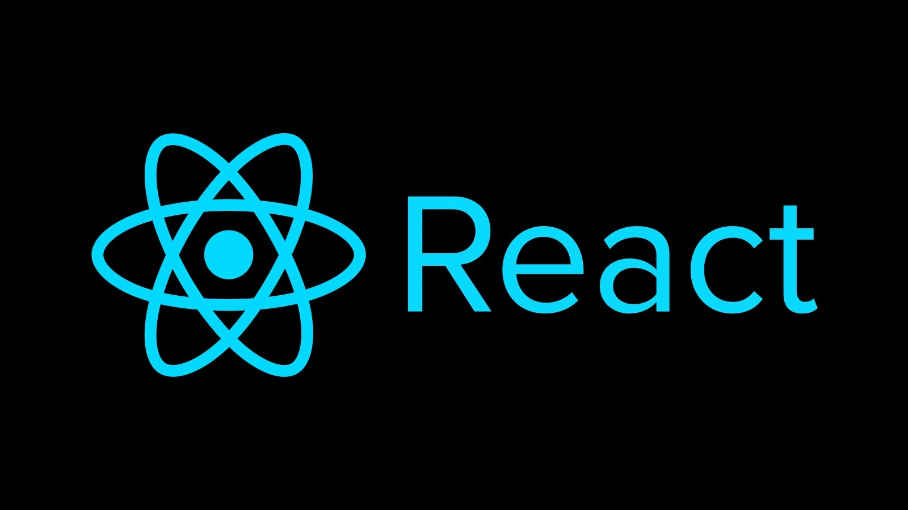
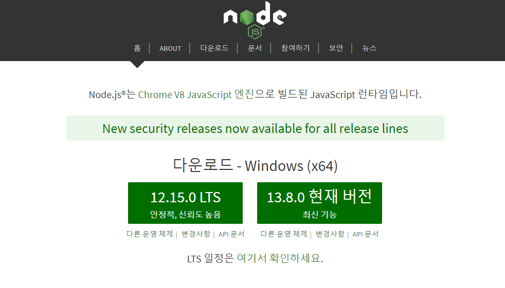

# 개발 환경 설정하기



리액트를 학습하기 앞서 먼저 개발 환경을 셋팅하는 법을 알아보겠다.  
VS Code나 Git은 설치되어 있는 관계로 이에 대한 설명은 생략 하겠다.

### 01. Version: Windows

#### 1-1. Node 설치하기 

[Node 다운로드](https://nodejs.org/ko/)



#### 1-2. 설치 명령어

```bash
/* react 설치 */
npm init react-app <프로젝트명>
```

#### 1-3. Git 명령어 

```bash
git init
git remote add origin <URL>
git config --global user.name "name"
git config --global user.email "email"

git status
git add .
git commit -m "message"
git push origin master
```

#### 참조

* [자습서: React 시작하기](https://ko.reactjs.org/)
* [리액트를 다루는 기술\(개정\) - 길벗](https://m.yes24.com/Goods/Detail/62597469) 
* [누구든지 하는 리액트: 초심자를 위한 react 핵심 강좌 - 인프런 ](https://www.inflearn.com/course/react-velopert/dashboard)
* [벨로퍼트와 함께하는 모던 리액트](https://react.vlpt.us/)

