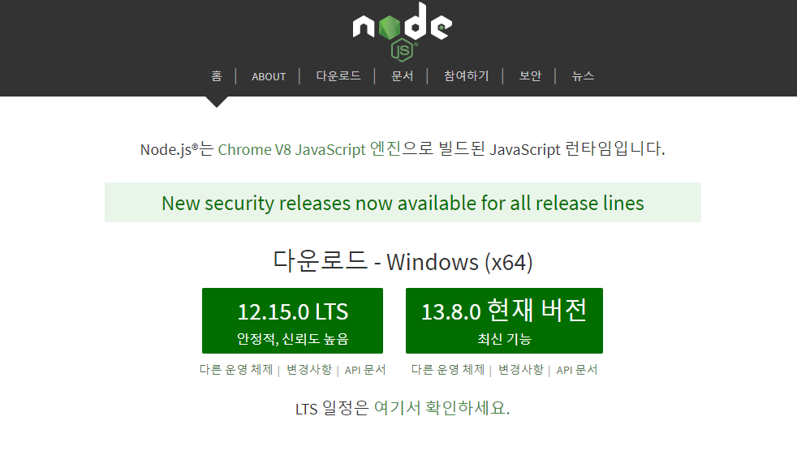

# 개발 환경 설정하기


### 01. Version: Windows

#### 1-1. Node 설치하기 

[Node 다운로드](https://nodejs.org/ko/)



#### 1-2. 설치 명령어

```bash
/* react 설치 */
npm init react-app <프로젝트명>
```

#### 1-3. Git 명령

```bash
git init
git remote add origin <URL>
git config --global user.name "name"
git config --global user.email "email"

git status
git add .
git commit -m "message"
git push origin master
```

