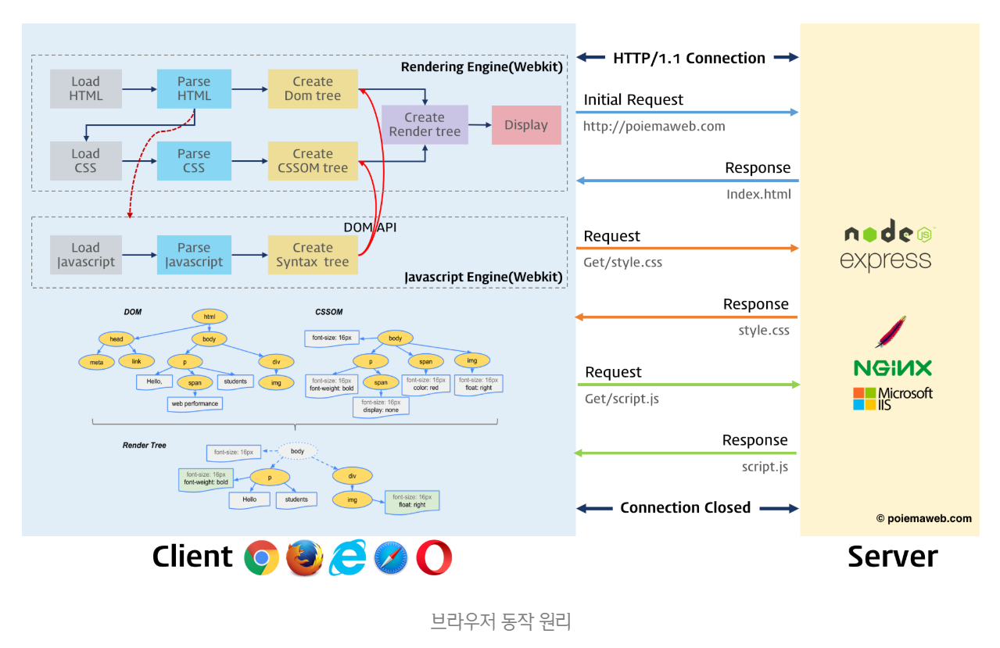
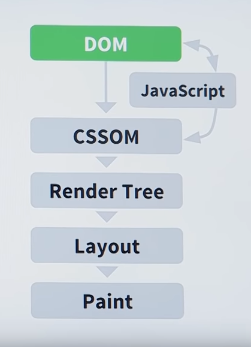
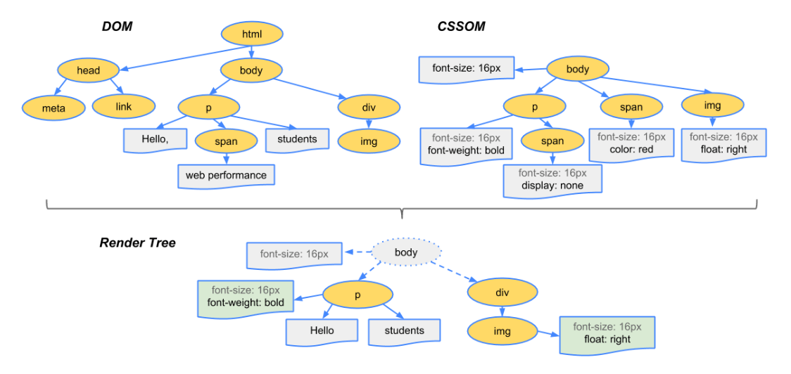

# 브라우저 동작원리

## 브라우저 동작원리\(Browser Workflow\)

 브라우저는 **동기\(Synchronous\)**적으로 HTML, CSS, Javascript를 처리한다.

### 브라우저 핵심 기능

* 사용자가 참조하고자 하는 웹페이지를 서버에 요청\(Request\)하고 서버의 응답\(Response\)을 받아 브라우저에 표시하는 것
* URI를 입력 후 브라우저는 서버로부터 HTML, CSS, Javascript, 이미지 파일 등을 응답 받는다.
* HTML, CSS 파일은 렌더링 엔진의 HTML 파서와 CSS 파서에 의해 파싱\(Parsing\)되어 DOM, CSSOM 트리로 변환되고 렌더 트리로 결합된다.
* 생성된 렌더 트리를 기반으로 브라우저는 웹페이지를 표시한다.

### Critical rendering path\(크리티컬 렌더링 패스\)

* CRP는 브라우저가 HTML, CSS, JavaScript를 화면에 실제 픽셀로 변환하는 단계의 순서를 의미하며 총 6단계의 과정을 거친다.

1. HTML파일이 렌더링 엔진의 HTML파서에 의해 파싱\(Parsing\)되어 DOM 생성
   * HTML 태그들 HTML 토큰이 되어 node 객체로 변환되고 이는 트리 형태로 되어 있다.
2. CSS파일이 렌더링 엔진의 CSS 파서에 의해 파싱\(Parsing\)되어 CSSOM 생성
3. JavaScript엔진이 JavaScript파일을 로드하고 파싱하여 실행 \(DOM생성이 중지됨\) 
4. DOM과 CSSOM을 묶어 Render Tree를 생성 
5. Layout이 생성되며 객체의 정확한 위치 및 크기를 계산한다.
6. 마지막 단계는 최종 렌더링 트리에서 수행되는 페인트이며, 픽셀을 화면에 렌더링한다.

### 참조

* [브라우저 동작 원리 - poiemaweb](https://poiemaweb.com/js-browser)
* [브라우저는 어떻게 동작하는가? - NAVER D2](https://d2.naver.com/helloworld/59361)
* [렌더링 트리 생성, 레이아웃 및 페인트 - Google Developers](https://developers.google.com/web/fundamentals/performance/critical-rendering-path/render-tree-construction?hl=ko)
* [자바스크립트로 상호작용 추가 - Google Developers](https://developers.google.com/web/fundamentals/performance/critical-rendering-path/adding-interactivity-with-javascript?hl=ko)
*  [Web Performance Optimization - Udacity](https://www.youtube.com/watch?v=d_oIZzkyQ-E&list=PLAwxTw4SYaPmKmNX-INgcxQWf30KuWa_A&index=8) 

