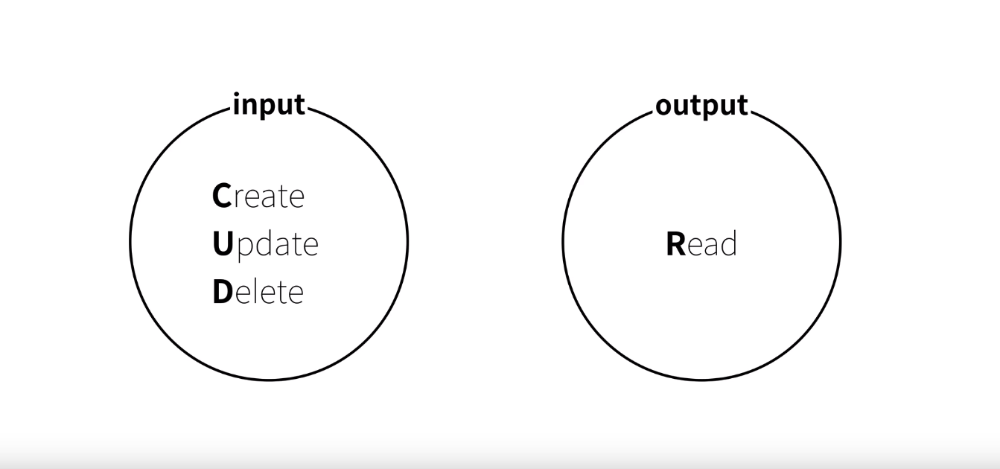

# DATABASE란?

### DATABASE란?&#x20;

* 여러 사람이 공유하여 사용할 목적으로 체계화해 통합, 관리하는 데이터의 집합&#x20;
* 중복된 데이터를 없애고, 자료를 구조화하여, 효율적인 처리를 할 수 있도록 관리 하 기술&#x20;
* 데이터베이스는 응용 프로그램과는 다른 별도의 미들웨어에 의해 관리된다.
* 데이터베이스를 관리하는 이러한 미들웨어를 _**데이터베이스 관리 시스템 **_(**DBMS**: Database Management System)이라고한다.

### DATABASE 특징

* **실시간 접근성**
  * 사용자의 질의에 대하여 즉각적인 처리와 응답이 이루어진다.
* **지속적인 변화**
  * 생성, 수정, 삭제를 통하여 항상 최신의 데이터를 유지한다.
* **동시 공유 **
  * 사용자들이 원하는 데이터를 동시에 공유할 수 있다.
* **내용에 대한 참조**&#x20;
  * 사용자가 원하는 데이터를 주소가 아닌 내용에 따라 참조 할 수 있다.
* **데이터 논리적 독립성**&#x20;
  * 응용프로그램과 데이터베이스는 독립되어 있으므로, 데이터의 논리적 구조와 응용프로그램은 별개로 동작한다.

### DATABASE 본질

* 데이터베이스의 본질은** CRUD**입니다.
* **입력(INPUT)**과 **출력(OUTPUT)** 을 이해하는것이 바로 데이터베이스의 본질을 이해하는 것입니다.
* **INPUT** - **C**reate, **U**pdate, **D**elete
* **OUTPUT** - **R**ead

### DATABASE Model 종류

